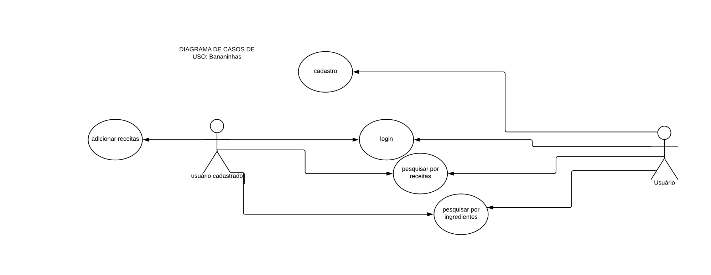
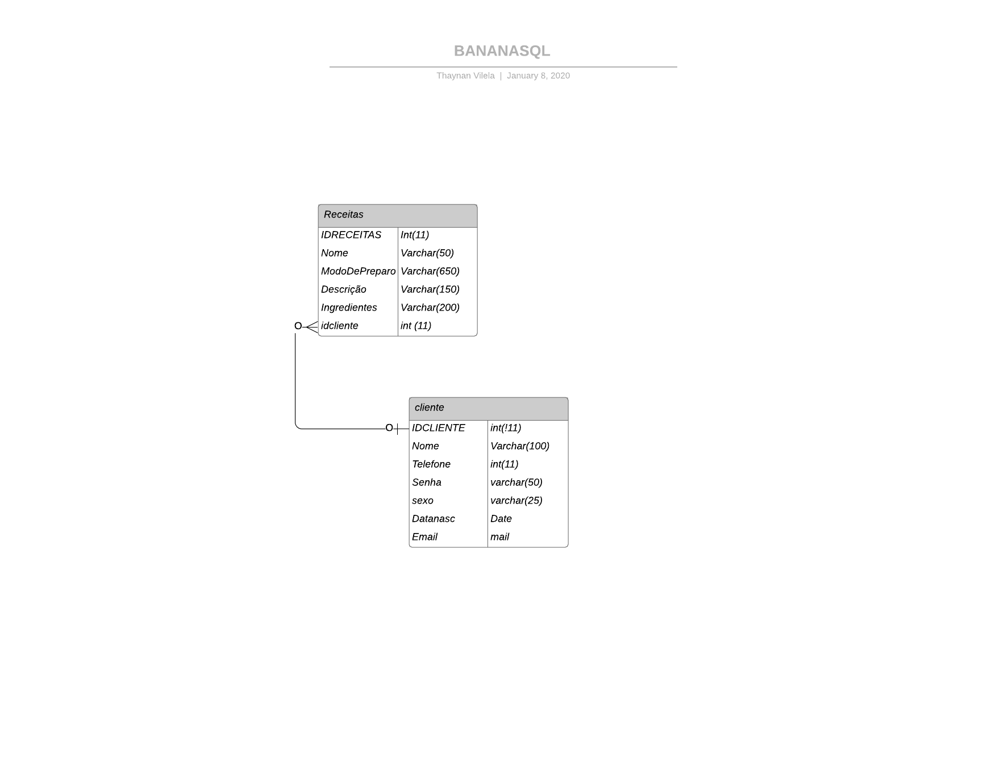

# Bananinhas Receitas
Sistema de busca de receitas, Projeto Final do Curso Técnico em Desenvolvimento de Sistemas do Colégio Pedro II – Campus Duque de Caxias – 2019
## Desenvolvedores:
- Matheus Pereira da Silva 
- Felipe Siqueira 
- Thaynan Vilela 
- Uilson Gabriel 

## Navegação

- [Proposta](https://github.com/cp2-dc-info-projeto-final/bananinhas-receitas/blob/master/Modelo/Proposta.md)

- [Entrevista](https://github.com/cp2-dc-info-projeto-final/bananinhas-receitas/blob/master/Modelo/Entrevista.md)

- [Audio da Entrevista](https://github.com/cp2-dc-info-projeto-final/bananinhas-receitas/tree/master/Modelo/AudioEntrevista)

- [Requisitos](https://github.com/cp2-dc-info-projeto-final/bananinhas-receitas/blob/master/Modelo/Requisitos.md) 

- [CDU](https://github.com/cp2-dc-info-projeto-final/bananinhas-receitas/blob/master/Modelo/Casosdeuso.md)

### [Casos de Uso] 

### [Modelagem] 

